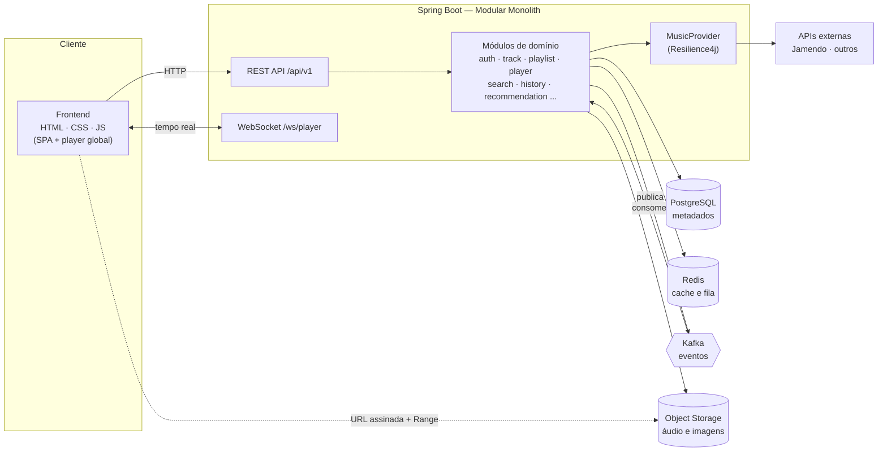
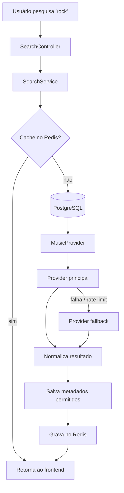
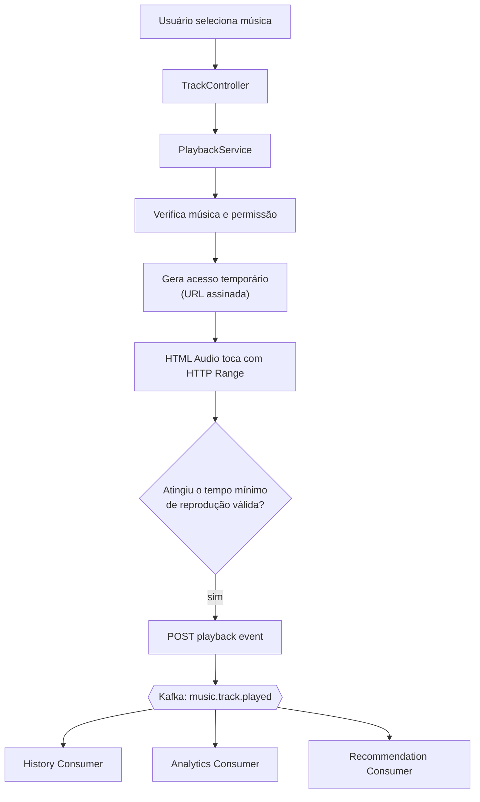

<h1 align="center">🎧 Pulse Music</h1>

<p align="center">
  <b>Plataforma de streaming de música com identidade e arquitetura próprias</b><br>
  Projeto de estudo e portfólio construído com as práticas usadas em projetos Java reais.
</p>

<p align="center">
  
  
  
  
  
  
  
</p>

<!-- Badge do pipeline — ativar quando o workflow .github/workflows/ci.yml for criado (Fase 11):
[](https://github.com/max777-cyber/Pulse-music/actions/workflows/ci.yml)
-->

---

## Sumário

- [Objetivo](#-objetivo)
- [Funcionalidades](#-funcionalidades)
- [Stack](#-stack)
- [Arquitetura](#-arquitetura)
- [Estrutura do projeto](#-estrutura-do-projeto)
- [Fluxos principais](#-fluxos-principais)
- [Provedores de música e fallback](#-provedores-de-música-e-fallback)
- [Redis](#-redis)
- [Kafka](#-kafka)
- [Autenticação e segurança](#-autenticação-e-segurança)
- [Endpoints](#-endpoints)
- [Como executar](#-como-executar)
- [Variáveis de ambiente](#-variáveis-de-ambiente)
- [Testes](#-testes)
- [Roadmap](#-roadmap)
- [Screenshots](#-screenshots)
- [Autores](#-autores)

---

## Objetivo

O **Pulse Music** é uma aplicação web de streaming de música inspirada em serviços como o Spotify, mas com arquitetura e identidade próprias. A ideia não é fazer um clone visual, e sim um sistema completo que mostre na prática:

- API REST com **Java + Spring Boot** organizada como **monólito modular**
- Autenticação com **e-mail/senha** e **Login com Google (OAuth2)**
- **Cache com Redis**, **eventos com Kafka** e **tempo real com WebSocket**
- Integração com **APIs externas de música** com **fallback e resiliência**
- Armazenamento de áudio e imagens em **Object Storage (S3)**
- **Docker**, **CI/CD com GitHub Actions**, testes e deploy no **Railway**

> Projeto em desenvolvimento, feito por etapas. Veja o [Roadmap](#-roadmap) para saber o que já está pronto.

---

## Funcionalidades

| Área | Recursos |
|---|---|
| Conta | Cadastro, login com e-mail/senha, Login com Google, planos `FREE` / `PREMIUM` |
| Catálogo | Músicas, artistas, álbuns e gêneros, de fontes locais e externas |
| Player | Play, pause, próxima, anterior, volume, seek, shuffle, repeat, repeat-one e fila |
| Navegação | Player global que **não para** ao trocar de tela (SPA com History API) |
| Biblioteca | Curtir, favoritar, seguir artistas |
| Playlists | Criar, editar, excluir, reordenar músicas, playlists públicas com link compartilhável |
| Busca | Busca unificada de músicas, artistas, álbuns e playlists, com filtros |
| Home | Mais ouvidas, tocadas recentemente, recomendadas, novidades e blocos por gênero |
| Recomendações | Baseadas em gêneros, curtidas, artistas seguidos e histórico |
| Retrospectiva | "Wrapped" anual: top músicas, artistas, gêneros e minutos ouvidos |
| Upload | Envio de músicas próprias por `ARTIST` e `ADMIN`, com validação e confirmação de direitos |
| Admin | Moderação de uploads, gestão de catálogo e usuários, métricas e erros dos providers |
| Tempo real | Sincronização do player e da fila entre abas e dispositivos |

---

## Stack

**Backend**

`Java` · `Spring Boot` · `Spring Web` · `Spring Security` · `Spring Data JPA` · `Spring Validation` · `Spring OAuth2 Client` · `Resilience4j` · `WebSocket` · `Maven`

**Frontend**

`HTML` · `CSS` · `JavaScript Vanilla` (SPA simples com History API)

**Dados e mensageria**

`PostgreSQL` · `Redis` · `Apache Kafka` · Object Storage compatível com S3 (`MinIO` no ambiente local)

**Infraestrutura e qualidade**

`Docker` · `Docker Compose` · `Railway` · `GitHub Actions` · `Swagger / OpenAPI` · `JUnit` · `Mockito` · `Testcontainers`

---

## Arquitetura

O projeto começa como um **Modular Monolith**: uma única aplicação, mas com domínios bem separados e comunicação entre eles por serviços e eventos. Assim cada módulo pode virar um microsserviço no futuro, sem precisar reescrever tudo.



**Decisões principais**

- **Arquivos de áudio nunca ficam no PostgreSQL.** O banco guarda só metadados e a *chave* do objeto (`audioObjectKey`, `imageObjectKey`). O áudio fica no Object Storage (`/audio`, `/covers`, `/artists`, `/albums`).
- **Nenhuma Entity JPA sai da API.** Tudo passa por DTOs e mappers.
- **Controllers sem regra de negócio.** A lógica fica na camada de serviço.
- **Efeitos colaterais via eventos.** Tocar uma música não espera a atualização de estatísticas, histórico e recomendações, porque isso é processado de forma assíncrona pelo Kafka.

---

## Estrutura do projeto

```
src/main/java/com/projeto/music/
├── auth/            # cadastro, login, OAuth2, tokens
├── user/            # perfil, planos, retrospectiva
├── artist/          # artistas e seguidores
├── album/
├── track/           # músicas, curtidas, favoritos
├── playlist/
├── library/         # biblioteca do usuário
├── player/          # reprodução, fila, WebSocket
├── history/         # histórico de reprodução
├── recommendation/
├── search/
├── upload/          # upload e validação de arquivos
├── subscription/    # planos (pagamento no futuro)
├── analytics/       # consumidores de eventos e estatísticas
├── integration/     # MusicProvider e APIs externas
├── admin/
├── config/
├── security/
└── shared/          # exceções, respostas de erro, utilitários
```

Cada domínio segue, quando necessário, a mesma organização interna:

```
track/
├── controller/
├── service/
├── repository/
├── entity/
├── dto/
├── mapper/
├── event/
└── exception/
```

---

## Fluxos principais

### Busca



### Reprodução



- **Reprodução válida:** um clique não conta como play. A reprodução só é registrada depois de um tempo mínimo de audição, definido numa regra **centralizada e configurável**, o que também dificulta inflar o contador com refresh.
- **Streaming:** o áudio é servido com **HTTP Range Requests**, então dá pra avançar e voltar sem baixar o arquivo inteiro antes de começar a tocar.
- **Player persistente:** o elemento `<audio>` vive num *shell* principal fixo, e as telas são trocadas por JavaScript + History API, então a música continua tocando durante a navegação.

---

## Provedores de música e fallback

A aplicação não depende de uma única API. Os serviços conversam com a abstração `MusicProvider`:

```java
public interface MusicProvider {
    List<TrackDTO> search(SearchQuery query);
    Optional<TrackDTO> getTrack(String externalId);
    Optional<ArtistDTO> getArtist(String externalId);
    Optional<AlbumDTO> getAlbum(String externalId);
    StreamSource getStream(String externalId);
    Optional<DownloadedFile> downloadIfAllowed(String externalId);
    ProviderCapabilities capabilities();
}
```

| Implementação | Descrição |
|---|---|
| `JamendoMusicProvider` | Provider principal, com músicas sob licenças abertas |
| `LocalMusicProvider` | Músicas enviadas por upload e armazenadas no Object Storage |
| `FutureMusicProvider` | Ponto de extensão para novas fontes |

Cada provider informa **disponibilidade**, **se permite streaming**, **se permite download**, **licença** e **origem**. As chamadas externas são protegidas com **Resilience4j**: `Retry`, `Circuit Breaker`, `TimeLimiter` e `RateLimiter`.

**Ingestão:** quando a licença permite, a música é validada, baixada, salva no Object Storage e registrada no PostgreSQL. As próximas reproduções usam a cópia própria, sem chamar a API de novo.

> Nenhum áudio é armazenado automaticamente se os termos ou a licença da fonte não permitirem.

---

## Redis

Usado **apenas como cache** e estado temporário, nunca como banco permanente.

| Chave (exemplo) | Conteúdo | TTL aproximado |
|---|---|---|
| `search:{termo}` | Resultados de busca | 5 – 10 min |
| `home:{userId}` | Blocos da home | 10 – 15 min |
| `tracks:popular` | Músicas mais ouvidas | 15 – 30 min |
| `genre:{nome}` | Resultados por gênero | 15 – 30 min |
| `artist:{id}` / `album:{id}` | Artistas e álbuns | 30 min |
| `recommendations:{userId}` | Recomendações | 15 – 30 min |
| `provider:{nome}:{id}` | Respostas de APIs externas | 30 min |
| `queue:{userId}` | Fila de reprodução temporária | enquanto a sessão durar |

---

## 📨 Kafka

O Kafka tem uso real: desacoplar a ação do usuário do processamento pesado.

| Tópico | Evento | Consumidores |
|---|---|---|
| `music.track.played` | `TrackPlayedEvent` | Histórico, contador de plays, recomendações |
| `music.track.liked` | `TrackLikedEvent` | Recomendações, estatísticas |
| `music.track.favorited` | `TrackFavoritedEvent` | Recomendações |
| `music.playlist.created` | `PlaylistCreatedEvent` | Estatísticas |
| `music.user.created` | `UserRegisteredEvent` | Boas-vindas, estatísticas |
| `music.artist.followed` | `ArtistFollowedEvent` | Contador de seguidores, recomendações |

---

## Autenticação e segurança

- Login com **e-mail + senha** e **Google OAuth2**
- **Access token + refresh token** em **cookies HTTP-only seguros**, sem guardar credenciais no `localStorage`
- Senhas com **BCrypt**, nunca em texto puro
- Papéis: `ROLE_USER`, `ROLE_ARTIST`, `ROLE_ADMIN`, e endpoints `/admin` bloqueados para usuários comuns
- Validação de DTOs, **rate limiting**, **CORS** configurado, **CSRF** quando aplicável e headers de segurança
- Uploads validados por **extensão, MIME type, tamanho e duração**, com **hash SHA-256** para detectar duplicados e proteção contra *path traversal*
- **Nenhuma chave de API no frontend.** Todos os segredos ficam em variáveis de ambiente.

---

## Endpoints

Todas as rotas seguem o prefixo `/api/v1`. A documentação completa fica no **Swagger UI** em `/swagger-ui.html`.

| Recurso | Exemplos |
|---|---|
| Auth | `POST /auth/register` · `POST /auth/login` · `POST /auth/refresh` · `POST /auth/logout` |
| Usuário | `GET /users/me` · `GET /users/me/wrapped/{year}` |
| Músicas | `GET /tracks/{id}` · `GET /tracks/{id}/play` · `POST` / `DELETE /tracks/{id}/like` · `POST` / `DELETE /tracks/{id}/favorite` |
| Artistas | `GET /artists/{id}` · `POST` / `DELETE /artists/{id}/follow` |
| Álbuns | `GET /albums/{id}` |
| Playlists | `POST /playlists` · `PUT /playlists/{id}` · `DELETE /playlists/{id}` · `POST /playlists/{id}/tracks` · `PATCH /playlists/{id}/tracks/order` |
| Busca | `GET /search?q=rock&type=track,artist&genre=rock` |
| Home | `GET /home` |
| Biblioteca | `GET /library` |
| Histórico | `GET /history` · `POST /player/events` |
| Recomendações | `GET /recommendations` |
| Player / fila | `GET /player/queue` · `POST /player/queue` · `DELETE /player/queue/{position}` |
| Upload | `POST /upload/tracks` |
| Admin | `/admin/users` · `/admin/tracks` · `/admin/uploads` · `/admin/stats` |
| WebSocket | `/ws/player` com os eventos `PLAY`, `PAUSE`, `NEXT`, `PREVIOUS`, `QUEUE_CHANGED` |

**Padrão de erro** (via `@RestControllerAdvice`):

```json
{
  "timestamp": "2026-09-23T21:00:00Z",
  "status": 404,
  "error": "TRACK_NOT_FOUND",
  "message": "Música não encontrada",
  "path": "/api/v1/tracks/10"
}
```

---

## Como executar

### Pré-requisitos

- Java 21+
- Maven 3.9+ (ou o wrapper `./mvnw`)
- Docker e Docker Compose

### Com Docker Compose (recomendado)

```bash
git clone https://github.com/max777-cyber/Pulse-music.git
cd Pulse-music

cp .env.example .env    # preencha as variáveis
docker compose up -d    # sobe backend, postgres, redis, kafka e minio
```

| Serviço | Endereço local |
|---|---|
| Aplicação | http://localhost:8080 |
| Swagger UI | http://localhost:8080/swagger-ui.html |
| MinIO Console | http://localhost:9001 |

### Rodando o backend fora do Docker

```bash
docker compose up -d postgres redis kafka minio
./mvnw spring-boot:run
```

---

## Variáveis de ambiente

| Variável | Descrição |
|---|---|
| `DATABASE_URL` | URL JDBC do PostgreSQL |
| `DATABASE_USERNAME` | Usuário do banco |
| `DATABASE_PASSWORD` | Senha do banco |
| `REDIS_URL` | URL de conexão do Redis |
| `KAFKA_BOOTSTRAP_SERVERS` | Endereço dos brokers Kafka |
| `GOOGLE_CLIENT_ID` | Client ID do OAuth2 Google |
| `GOOGLE_CLIENT_SECRET` | Client secret do OAuth2 Google |
| `JWT_SECRET` | Chave de assinatura dos tokens |
| `MUSIC_PROVIDER_KEY` | Chave da API do provider de música |
| `OBJECT_STORAGE_ENDPOINT` | Endpoint S3 / MinIO |
| `OBJECT_STORAGE_ACCESS_KEY` | Access key do storage |
| `OBJECT_STORAGE_SECRET_KEY` | Secret key do storage |
| `OBJECT_STORAGE_BUCKET` | Nome do bucket |

> Nunca faça commit do arquivo `.env`. Em produção, as variáveis são configuradas direto no painel do **Railway**.

---

## Testes

```bash
./mvnw test
```

O foco dos testes é **regra de negócio**, não cobertura artificial:

- `AuthService`, `PlaylistService`, `TrackService`, `HistoryService` e `RecommendationService`
- `MusicProvider` e **fallback entre providers**
- **Controle de permissões** por papel
- Testes de integração com **Testcontainers** (PostgreSQL, Redis, Kafka) quando fizer sentido

O pipeline do **GitHub Actions** compila, valida o Maven e roda os testes em todo Pull Request. Na branch principal, também faz o build e prepara o deploy.

---

## Roadmap

- [ ] **Fase 1:** estrutura Spring Boot, PostgreSQL, entidades principais, migrations, Docker
- [ ] **Fase 2:** cadastro, login, Google OAuth, Spring Security
- [ ] **Fase 3:** Artist, Album, Track e gêneros
- [ ] **Fase 4:** MusicProvider, Jamendo, cache Redis, fallback de providers
- [ ] **Fase 5:** reprodução, Object Storage, HTML Audio, player persistente
- [ ] **Fase 6:** favoritos, curtidas, artistas seguidos, playlists
- [ ] **Fase 7:** histórico, Kafka, contador de reproduções
- [ ] **Fase 8:** recomendações, mais ouvidas, retrospectiva
- [ ] **Fase 9:** upload, perfis ARTIST e ADMIN
- [ ] **Fase 10:** WebSocket, sincronização do player, fila
- [ ] **Fase 11:** testes, Swagger, GitHub Actions, Railway, documentação

**Futuro:** pagamentos para o plano PREMIUM, recomendação colaborativa/IA, busca com Elasticsearch/OpenSearch e extração de módulos para microsserviços.

---

##  Screenshots

> Em breve: as imagens da interface serão adicionadas conforme as fases forem concluídas.

---

## Autores

**Maximillian Benjamin Vicente**
Estudante de Análise e Desenvolvimento de Sistemas · Desenvolvedor Java em formação

[](https://www.linkedin.com/in/maximillian-benjamin-vicente)
[](https://github.com/max777-cyber)

**Pedro Henrique Correia**
Colaborador · colega de turma no Técnico em TI do CEFSA

[](https://www.linkedin.com/in/pedro-correia-476113437)
[](https://github.com/correia44)

**Lucas Santana**
Colaborador · colega de turma no Técnico em TI do CEFSA

[](https://www.linkedin.com/in/lucas-santana-3258812b4)
[](https://github.com/LucasSantana34)

---

<p align="center">Projeto desenvolvido para estudo e portfólio. As músicas externas seguem as licenças de suas respectivas fontes.</p>
